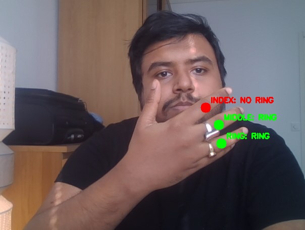
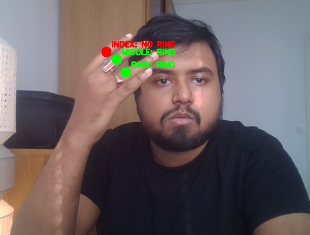
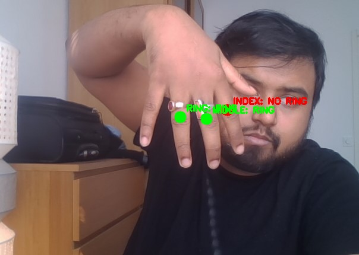
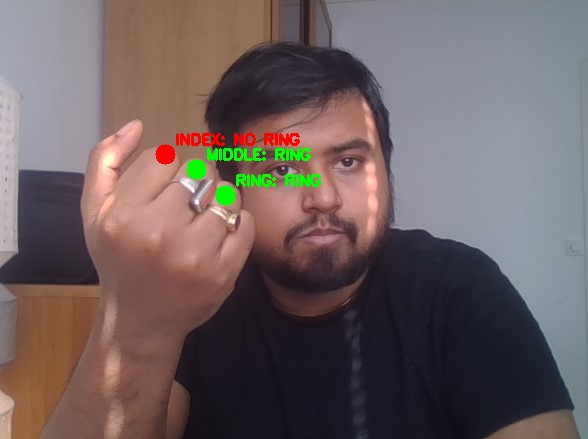

---

### 3. **`design_doc.md` (Project Reasoning + Thought Process)**

# Jewelry Detection Challenge

## 👩‍💻 Assumptions

- User wears rings on three fingers: index, middle, and ring.
- Only **rings** are tracked for now.
- The goal is to build a simple, real-time system to detect rings from webcam video using computer vision.

---

## 🎯 Project Scope

- Build a CNN-based ring classifier trained on labeled patches.
- Use MediaPipe Hands to detect finger landmarks and crop finger patches.
- Run real-time classification of ring presence at specific finger joints.

---

## 🧠 Thought Process & Design

### Why MediaPipe?
MediaPipe Hands gives reliable and efficient multi-point hand landmarks, making it easy to crop patches for ring detection without needing expensive hand segmentation or pose models.
This project was based off on a seperate project of mine where I used MediaPipe Hands extentensively for Gesture Recognition.

### Why a CNN Classifier?
We framed the ring detection as a binary classification problem to not just track finger joints using Mediapipe but the jewellery present:
- Input: cropped image around a joint
- Output: ring / no ring

CNNs are lightweight, easy to train, and sufficient for this image-level task.

---

## 🔁 Training

- Used ImageDataGenerator to apply **Data Augmentation** for better results:
  - Rotation, shift, shear, zoom, flip, brightness
- Model: 2 Conv2D layers + MaxPool + Dense + Dropout
- Trained for 100 epochs with **ModelCheckpoint** for best accuracy

---

## 🎥 Inference Pipeline

1. Capture webcam video
2. Detect hand landmarks using MediaPipe
3. For each joint (index, middle, ring): (can be extended to thumb and Pinky)
   - Crop a 64×64 patch
   - Normalize and pass to classifier
   - Predict “RING” or “NO RING”
   - Display result live on video feed

---

## 📷 Sample Inference Results

Below are real-time screenshots showing ring detection results on the index, middle, and ring fingers using MediaPipe and the trained CNN.

| Pose 1 | Pose 2 |
|--------|--------|
|  |  |

| Pose 3 | Pose 4 |
|--------|--------|
|  |  |

| Pose 5 |  |
|--------|--|
|  |  |

> ✅ Green dot = "RING" detected, ❌ Red dot = "NO RING"  
> These samples illustrate both successful detections and occasional misclassifications under varying hand poses, lighting, and angles.

## 🔍 Observations / Failures

- Small patches sometimes miss the ring if hand is tilted or occluded
- Classifier fails with motion blur or low light.
- Works with inverted hand poses and a variety of hand postures
- Classifier fails in certain webcam frames due to lack of training data and lightweight model
- Using pretrained classifiers like ResNet-50 or others worsens performance.

---

## ✨ What I Would Do With More Time

- Add **earring detection** using face landmarks.
- Use VGG style annotation for the images for better segmentation & classification performance.
- Multi-frame voting or object detection models (e.g. YOLO)
- Integrate a **3D hand model** using Blender for smooth jewelry placement/visualization.
- Recognition of ring styles and cluster using image features (ResNet) and recommend similar designs
- Add a multi-label classifier for ring **type/style/color**

---

## 📌 Key Takeaways

This project demonstrates:
- Landmark-based tracking
- Real-time inference via webcam
- CNN image classification on specific body parts

It’s a lightweight, modular  and extensible approach.
